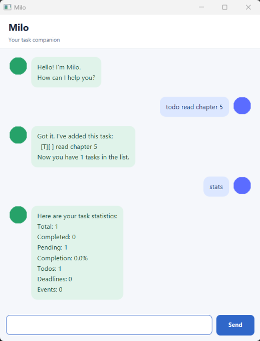

# Milo User Guide

Milo is a small task companion for keeping track of todos, deadlines, and events. It saves your tasks between sessions and shows how much of your list is complete.



## Getting started

Install Java 25, download the `.jar` file from the [latest release](https://github.com/duynguyen21007/ip/releases/latest), and run it from a terminal:

```text
java -jar duke.jar
```

The application opens a window titled **Milo**. Type a command in the box at the bottom and press **Enter** or click **Send**. Milo saves tasks to `data/duke.txt` in the directory from which you run the JAR. It creates that file when you first add a task. Keep the JAR in the same working directory on later runs to see the same tasks. You can also run the console version from source with `milo.Milo`.

Dates in commands use `yyyy-MM-dd`, such as `2026-09-18`. Command words are lowercase. Milo shows invalid commands and storage errors as highlighted replies in the graphical window.

## Adding tasks

Use `todo DESCRIPTION` for a task without a date:

```text
todo read chapter 5
```

Use `deadline DESCRIPTION /by DATE` for a task due on a date:

```text
deadline submit report /by 2026-09-18
```

Use `event DESCRIPTION /from START /to END` for an event spanning two dates. The end date must be after the start date:

```text
event project meeting /from 2026-09-18 /to 2026-09-19
```

Milo confirms each addition and shows its task type: `[T]` for todo, `[D]` for deadline, or `[E]` for event. `[ ]` means pending and `[X]` means completed.

## Viewing and finding tasks

Enter `list` to see every task with its number. For example:

```text
1.[T][ ] read chapter 5
2.[D][ ] submit report (by: Sep 18 2026)
```

Enter `find KEYWORD` to see tasks whose descriptions contain the keyword, regardless of letter case. For example, `find report` finds `submit report`. The numbers shown in search results identify the result positions; use `list` to check a task's number in the full list before marking or deleting it.

## Updating tasks

Use a number from `list` with these commands:

* `mark 2` marks task 2 as completed.
* `unmark 2` marks task 2 as pending again.
* `delete 2` removes task 2 permanently. Remaining tasks are renumbered.

If the number does not exist, Milo reports an error and leaves the list unchanged. Changes are saved automatically; if saving fails, Milo reports the error and keeps the previous task state.

## Viewing statistics

Enter `stats` to see total, completed, and pending counts; completion percentage; and the number of todos, deadlines, and events. For example:

```text
Here are your task statistics:
Total: 3
Completed: 1
Pending: 2
Completion: 33.3%
Todos: 1
Deadlines: 1
Events: 1
```

Statistics cover the whole task list, even after `find`, and include both pending and completed tasks in each type count. An empty list shows `0.0%` completion. `stats` does not change or save your tasks.

## Exiting

Enter `bye` to close Milo. Your saved tasks are available the next time you run it from the same working directory.
